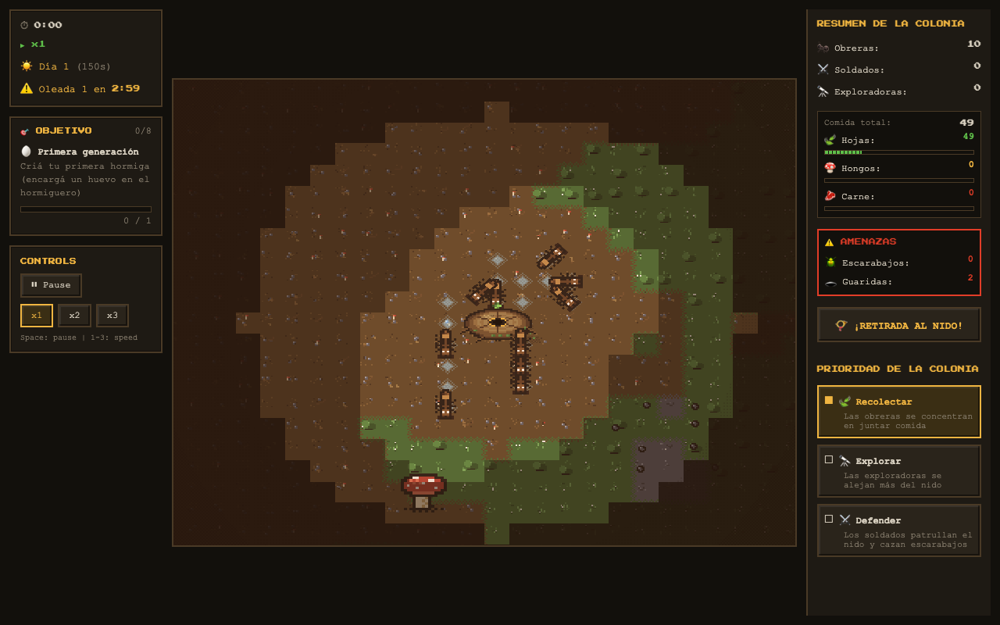
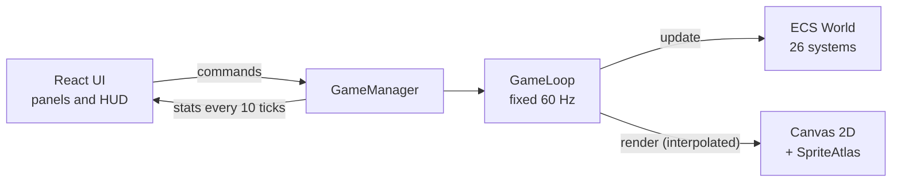

# Hormigas

A real-time ant colony simulation that runs in the browser. You run the colony, not the ants: you set priorities, queue new castes and dig the nest, and every ant decides on its own what to do next.

There is no game engine or game library behind it. The ECS, the fixed-timestep loop, pathfinding and the pixel-art renderer are written from scratch in TypeScript; the only runtime dependencies are `react` and `react-dom`.

**▶ Play it: [cristopherreyesp.github.io/hormigas](https://cristopherreyesp.github.io/hormigas/)** (the in-game UI is in Spanish)



## Quick start

```bash
npm ci
npm run dev   # http://localhost:5173/hormigas/
```

| Command | What it does |
| --- | --- |
| `npm run dev` | Vite dev server with hot reload |
| `npm run build` | Type-check (`tsc -b`) and build to `dist/` |
| `npm test` | Vitest suite |
| `npm run lint` | ESLint |

## How to play

- **Keep the queen alive.** If she dies, from starvation or from invaders, the colony falls and the game ends.
- **Feed the colony.** Workers gather leaves, mushrooms and meat from fallen beetles and crickets.
- **Grow the nest.** Underground, you mark tiles to excavate and assign incubation, fungus farm, food storage and defense post zones.
- **Survive the night.** A day lasts 150 s and a night 60 s. Invasion waves arm on a timer and strike at nightfall, growing from 1 to 4 beetles.
- **Steer, don't micromanage.** The Gather, Explore and Defend priorities reweight how every ant scores its options.
- **Follow the objectives.** Eight goals guide the early game, from hatching your first ant to destroying three enemy dens.

Random events shake things up: rain, drought, disease, raids, leaf fall, resource blooms, panic, and a dead bird that drops a meat feast far from the nest.

### Controls

| Input | Action |
| --- | --- |
| Left click | Select |
| Click the selected nest | Go underground |
| Right or middle drag | Pan |
| Mouse wheel | Zoom (0.5×–4×) towards the pointer |
| `Space` | Pause |
| `1` `2` `3` | Game speed |
| `R` / `Home` | Reset the surface camera |
| `M` | Toggle the underground minimap |

## Architecture



| Area | Design |
| --- | --- |
| ECS | Numeric entity IDs and one store per component. Queries start from the smallest store, and systems run in priority order. |
| Game loop | `requestAnimationFrame` feeds an accumulator that steps the simulation at a fixed 60 ticks per second. Rendering interpolates between ticks, and frame time is capped at 250 ms to avoid a spiral of death. |
| Rendering | Canvas 2D. Every sprite is painted in code and cached on an offscreen canvas, so there are no sprite sheets. |
| World | Two 32 px tile grids: the surface (120×90) holds terrain and pheromones, the underground (90×60) holds tunnels, chambers and stored food. |
| Pathfinding | Octile A* with 8 neighbours on the surface; BFS with waypoint simplification underground. |
| Ant AI | Each ant scores its options by role, weighted by the colony priority. Food and enemy positions are snapshotted once per tick instead of scanned per ant. |
| React boundary | React owns the canvas and the manager's lifecycle. The simulation pushes stats to React every 10 ticks, so React never re-renders per frame. |

### Project layout

```text
src/
  engine/      ECS, game loop, input, camera and canvas renderer
  simulation/  tile grids and pathfinding
  game/        components, entities, systems and global events
  ui/          React panels, HUD and toolbars
  shared/      constants and types
scripts/       headless simulation scenarios and benchmarks
```

## Testing

- `npm test` runs the Vitest suite: regressions for underground movement and tile occupancy.
- `scripts/` holds about 30 headless scenarios that drive the real simulation without a browser: AI tactics, colony economy, deadlocks, wave timing and lighting. Run one with `npx tsx scripts/test-deadlock.ts`. They print their verdicts and are not wired into CI yet.
- `scripts/bench-450-ants.ts` runs 450 ants, 12 beetles and 200 food items for 600 ticks and reports the time spent in each system.

## Deployment

Every push to `main` builds the game and deploys it to GitHub Pages through `.github/workflows/deploy.yml`. Vite's `base` is set to `/hormigas/` because the site is served from that subpath.

## Tech stack

React 19 · TypeScript 6 · Vite 8 · Vitest
